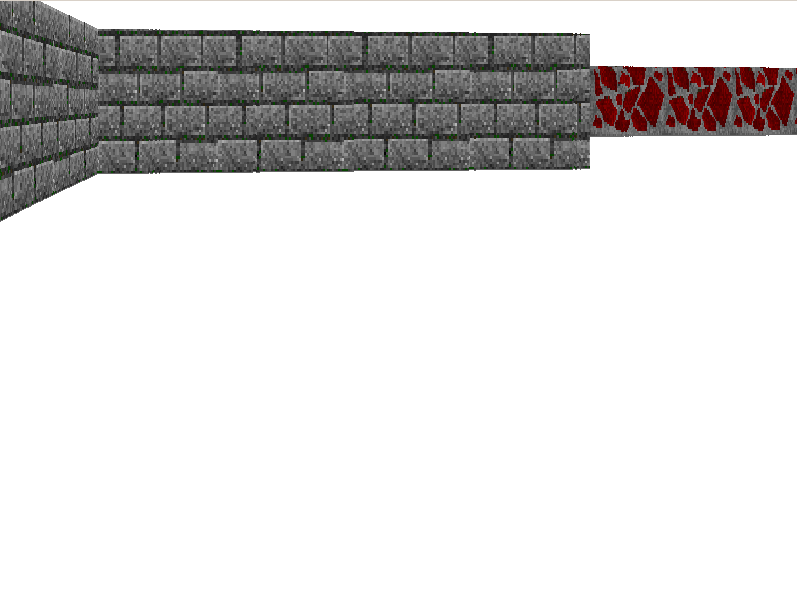

### Небольшая демонстрационная игра

Текущая версия: v0.0.1

Пишется под вдохновением статей:

* [простой 3D-шутер с нуля за выходные, часть 1](https://habr.com/ru/post/439698/)

**Скриншот карты:**

**Демо ролик:**

Известные баги:

1. По углом (если смотреть на стену) текстуры плывут
2. Не всегда верно обрабатываются влева и вправо (меняются местами)